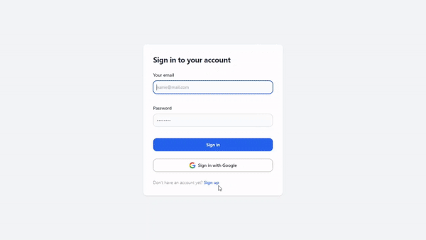

# DTS REA4 Final Project

Final project untuk kelas REA4A pair 25

## Preview

## Link live app

Live app bisa dilihat di [https://dts4a-25-final.netlify.app](https://dts4a-25-final.netlify.app).

## Penjelasan project

Untuk final project ini kami memutuskan untuk menggunakan api [Google Books APIs](https://developers.google.com/books).

Google Books adalah sebuah layanan pencarian buku atau ebook dan majalah yang disediakan oleh Google.

Adapun fitur yang kami buat diantaranya:

- Login dan register menggunakan email dan akun google.
- Error handling untuk proses authentication.
- Pencarian buku dengan fitur paginate.
- Detail buku yang menampilkan judul, pembuat, penerbit, deskripsi (jika ada), serta link eksternal menuju google books dan google paly books
- Fitur bookmark dimana kita bisa menyimpan daftar buku yang diiginkan

Notes: Untuk Google Books APIs hanya bisa mengambil maksimal 40 data, dan api memberikan total hasil pencarian. Sayangnya tiap mengambil data selanjutnya total hasil pencarian tersebut tidak akurat dan selalu berubah, sehingga jumlah halaman paginate selalu berubah. Jadi untuk halaman paginate paling akhir data selalu kosong. Namun untuk paginate prev, next dan halaman paginate awal masih berjalan dengan baik.
