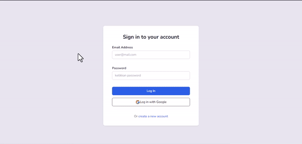

# DTS REA4 Final Project (Pair 11)

## Preview

## Link Live App

[Click Here](https://#)

## Penjelasan Aplikasi

Fitur Aplikasi mencakup :
- Authentication Firebase (Login / Logout / Register / Google)
- Daftar Surat
- Ayat Per Surat
- Simpan Ayat Pilihan (Fitur unit diluar pembelajaran)

## API 
API Quran yang digunakan [Quran.com API](https://api.quran.com/api/v3)
