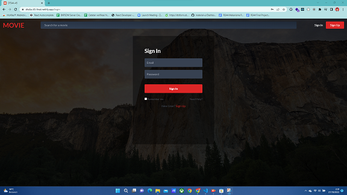

# DTS REA4 Final Project

Ketentuan lengkap bisa dilihat di [Final Project Guidelines](https://docs.google.com/document/d/122KyWNQ4xxU4aFwWbM4vIfH7LM4AH2CZEZa3YsEHjCk). 

## Daftar pair

Tugas dikerjakan secara berpasangan, untuk daftar kelompok bisa dilihat pada masing-masing Classroom atau Discord Class.

## Fork and Clone

Mohon perwakilan dari pair bisa melakukan fork repo ini dan clone, untuk repositori yang di fork menggunakan penamaan:

`dts4[a/b/c]-[nomor pair]-final`

Contoh: `dts4a-01-final`

## Branching, commit

Branch dapat sesuai dengan kebutuhan dan kesepakatan bersama dalam pair, namun hasil akhirnya harus di merge ke branch `main` dan di push ke Github. Pastikan hasil akhir kode sudah ter-push!

## link demo

link aplikasi : https://dts4a-45-final.netlify.app/

## gif demonstasi 

## fitur yang ada
### 1. Sign UP 

### 2. Sign In 

### 3. Home Page 

### 4. Detail Movie (harus login terlebih dahulu)

### 5. Search Movie

## 6. Log Out

